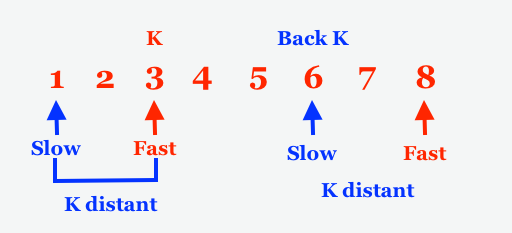

# 1721. Swapping Nodes in a Linked List
https://leetcode.com/problems/swapping-nodes-in-a-linked-list/

## Problem

You are given the head of a linked list, and an integer k.

Return the head of the linked list after swapping the values of the kth node from the beginning and the kth node from the end (the list is 1-indexed).

### Example 1:


```
Input: head = [1,2,3,4,5], k = 2
Output: [1,4,3,2,5]
```
### Example 2:
```
Input: head = [7,9,6,6,7,8,3,0,9,5], k = 5
Output: [7,9,6,6,8,7,3,0,9,5]
```


### Constraints:
* The number of nodes in the list is n.
* 1 <= k <= n <= 105
* 0 <= Node.val <= 100

## My solution
- First collect the loop through to collect poistion and value of the ListNode. 
- Caculate the k node and back k node
- re-create the ListNode
 
```
class Solution {
    public ListNode swapNodes(ListNode head, int k) {
        ListNode h = head;
        int count = 0;
        HashMap hashm = new HashMap();
        // loop through the ListNode to collect the val and find total count
        while (h != null){
            count++;   
            hashm.put(count, h.val);
            h = h.next;     
        }
        int nk = count - k + 1;    // calculate the backward poistion
        ListNode newHead = null ,last = null, temp = null;
        
        // loop through the HashMap to create the new ListNode
        for (int i = 1; i<= count; i++){
            if (i == k){
                    temp = new ListNode((int)hashm.get(nk));    // the the backword element
                }else if(i == nk){
                    temp = new ListNode((int)hashm.get(k));     // the k element
                }else{
                    temp = new ListNode((int)hashm.get(i));     // regular element
                }
            // adding the ListNode to new head
            if (newHead == null){        
                last =  temp;
                newHead = last;
            }else{
                last.next = temp;                
                last = last.next;
            }
        }        
        return newHead;
        
    }
}
```
## Other people solution

Using the slow-fast window technic to find the k-node and bk-node. 



```
class Solution {
    public ListNode swapNodes(ListNode head, int k) {
        ListNode slow = head;
        ListNode fast = head;
        ListNode kNode = head;
        ListNode bkNode = head;
        // [1,2,3,4,5]
        for(int i=0;i<k-1;i++)
        {
            fast = fast.next;        // fast = 2
        }   
        // Save the node for swapping
        kNode = fast;            // kNode = 2
        // Move until the end of the list
        while(fast.next != null)
        {
            slow = slow.next;
            fast = fast.next;
        }

        // Save the node for swapping
        bkNode = slow ;            // bkNode = 4

        // Swap first and second                
        int temp = kNode.val;
        kNode.val = bkNode.val;
        bkNode.val = temp;

        return head;
    }
}
```