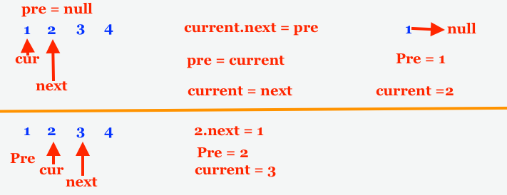

# 206. Reverse Linked List
https://leetcode.com/problems/reverse-linked-list/

## Problem

Given the head of a singly linked list, reverse the list, and return the reversed list.

### Example 1:


```
Input: head = [1,2,3,4,5]
Output: [5,4,3,2,1]
```
### Example 2:


```
Input: head = [1,2]
Output: [2,1]
```

### Example 3:

```
Input: head = []
Output: []
```


### Constraints:
* The number of nodes in the list is the range [0, 5000].
* -5000 <= Node.val <= 5000

## solution
 
```
class Solution {
    public ListNode reverseList(ListNode head) {
        
        ListNode current = head, pre = null, nextNode;
        while (current != null){
            nextNode = current.next;    // get next node
            current.next = pre;         // point the current next to pre node;
            pre = current;              // set pre node to current node
            current = nextNode;         // move current node to next node
        }
        
        return pre;

    }
}
```


