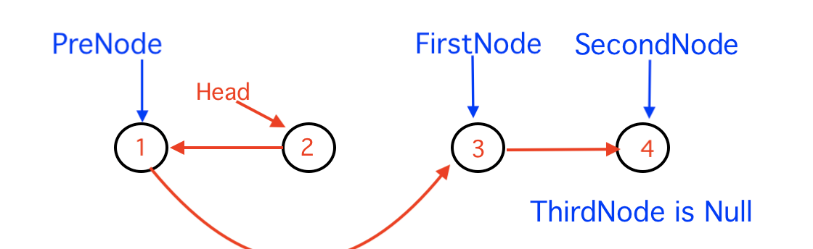

# 24. Swap Nodes in Pairs
https://leetcode.com/problems/swap-nodes-in-pairs/

## Problem

Given a linked list, swap every two adjacent nodes and return its head. You must solve the problem without modifying the values in the list's nodes (i.e., only nodes themselves may be changed.)


```
>> Example 1:
Input: head = [1,2,3,4]
Output: [2,1,4,3]
```

```
>> Example 2:
Input: head = []
Output: []
```
```
>> Example 3:
Input: head = [1]
Output: [1]
```

### Constraints:
* The number of nodes in the list is in the range [0, 100]
* 0 <= Node.val <= 100

## Understand LinkedList. 
A linked list is a common data structure made of a chain of nodes in which each node contains a value and a pointer to the next node in the chain.


The head pointer points to the first node, and the last element of the list points to null. When the list is empty, the head pointer points to null.

More details about linked list at here https://www.educative.io/edpresso/what-is-a-linked-list

### There are 3 type of basic linked list
* Singly-linked-list => one direction 
* Double-linked-list => bi-direction
* Circular-linked-list => circle

## Solution
This problem rate as medium, but it's not that hard, it's good problem to get familiar with linked list and how to swap node. 
The key for swap the node is to update the link to the correct node. 

Example: 1-2-3-4
Use the variable firstNode , secondNode , thirtdNode, and preNode to iterate the nodes for swaping link(next) pointer
* Update 1 next link point to 3 (firstNode.next = thirdNode)
* Update 2 next link point to 1 (secondNode.next = firstNode)
* Update the head to 2 (head = secondNode)


Next , move to next 3 nodes, you will need to know the firstNode, secondNode, thridNode, and also the preNode
* first step set preNode firstNode, then 
* move the firstNode variable to thirdNode
* move the secondNode to firstNode.next
* move the thirdNode to secondNode.next
* repeat the same swap logic



Looping throught while firstNode and secondNode is not nll

### code:
```
/**
 * Definition for singly-linked list.
 * public class ListNode {
 *     int val;
 *     ListNode next;
 *     ListNode() {}
 *     ListNode(int val) { this.val = val; }
 *     ListNode(int val, ListNode next) { this.val = val; this.next = next; }
 * }
 */
class Solution {
    
    public ListNode swapPairs(ListNode head) {
        if (head == null || head.next == null)
            return head;
        
        ListNode pre = null, firstNode = null, secondNode = null, thirdNode = null;
        // get the first 3 node
        firstNode = head;
        secondNode = firstNode.next;
        thirdNode = secondNode.next;
        head = secondNode;        
        while (firstNode != null && secondNode != null){
            // swap             
            secondNode.next = firstNode;
            firstNode.next = thirdNode;
            if (pre != null)
                pre.next = secondNode;
            // move each node to next 4 items            
            pre = firstNode;  // the next pre node is the 2nd position which is the firstNode
            firstNode = thirdNode;  //move the first node to the 3nd node
            if (firstNode != null)
                secondNode = firstNode.next; // get the second node 
            if (secondNode != null)
                thirdNode = secondNode.next; // get the third node
        }
        
        return head;
    }   
}
```
