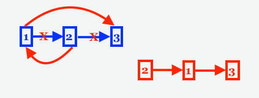

# 25. Reverse Nodes in k-Group
https://leetcode.com/problems/reverse-nodes-in-k-group/

## Problem

Given the head of a linked list, reverse the nodes of the list k at a time, and return the modified list.

k is a positive integer and is less than or equal to the length of the linked list. If the number of nodes is not a multiple of k then left-out nodes, in the end, should remain as it is.

You may not alter the values in the list's nodes, only nodes themselves may be changed.


### Example 1:


```
Input: head = [1,2,3,4,5], k = 2
Output: [2,1,4,3,5]
```

### Example 1:


```
Input: head = [1,2,3,4,5], k = 3
Output: [3,2,1,4,5]
```


### Constraints:
* The number of nodes in the list is n.
* 1 <= k <= n <= 5000
* 0 <= Node.val <= 1000


## Concept

### How to swap nodes



### code

* First count how many nodes.
* Add a dummy node to the head.  <= Key
* Swap nodes for every k nodes.
* How to swap node.


```
class Solution {
    public ListNode reverseKGroup(ListNode head, int k) {
        if(head==null||k==1)
            return head;
        
        // counting how many nodes
        ListNode temp = head;
        int count = 0;
        while (temp != null){
            count++;
            temp = temp.next;            
        }

        // Adding dummy node to the beginning of the head
        ListNode dummy = new ListNode(0);
        dummy.next = head;
        
        ListNode current = dummy;   // set current point to the beginning of head
        ListNode pre = current;
        ListNode after = current;

        while (count >= k){
            current = pre.next;
            after = current.next;
            for (int i = 1; i < k; i++){
                current.next = after.next;
                after.next = current;
                pre.next = after;
                after = current.next;
            }
           
            pre = current;
           count-=k;               
        }

        return dummy.next;
    }
}
```